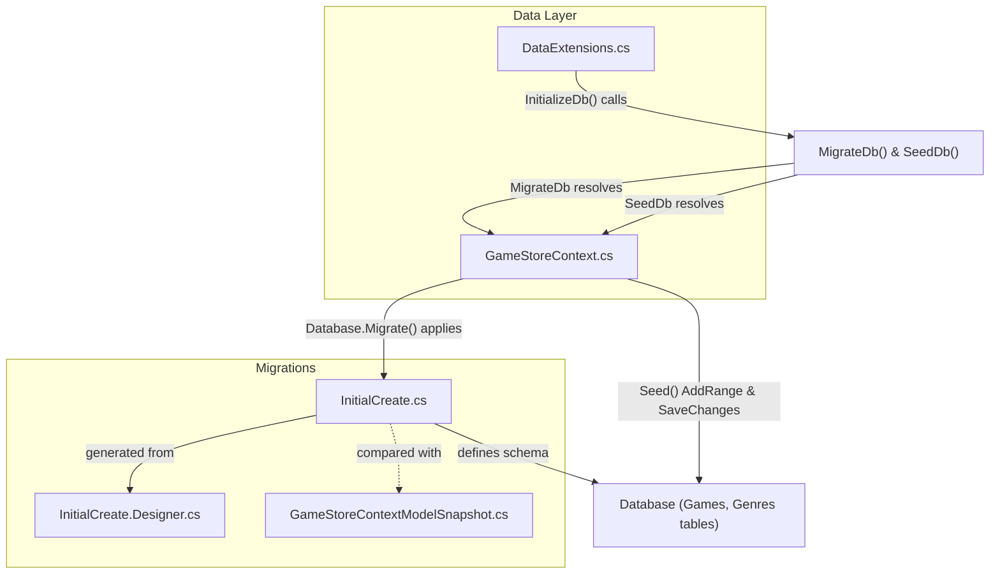

# Phase 2 Architecture — Backend Data Layer

DataExtensions.cs orchestrates database setup by first applying migrations via MigrateDb() (which resolves GameStoreContext and executes Database.Migrate() using the InitialCreate migration), then seeding default genre data via SeedDb(). The migration files define the relational schema for Games and Genres, and the model snapshot guides future schema comparisons.

---

*Generated by Codeia — re-run **Codeia: Generate Phase Diagram** to regenerate*
