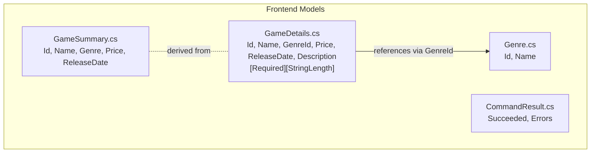

# Phase 4 Architecture — Frontend Models

Phase 4 defines client-side data types that mirror backend DTOs. GameDetails contains validation attributes and references Genre through its GenreId, enabling dropdown binding and validation. GameSummary is a simplified projection used for list displays, while Genre serves as a lookup model. CommandResult captures operation success/failure with error messages, independent of the other models.

---

*Generated by Codeia — re-run **Codeia: Generate Phase Diagram** to regenerate*
