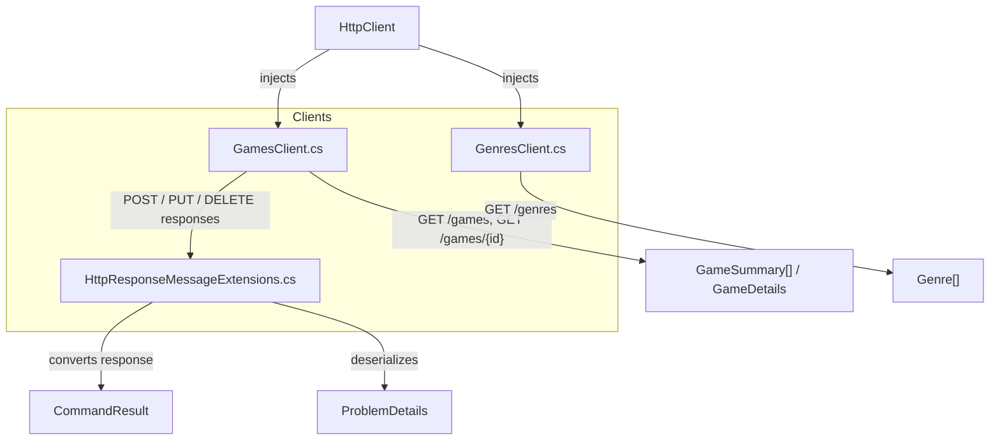

# Phase 5 Architecture — Frontend API Clients

The diagram illustrates the typed HTTP clients and the response-handling extension. GamesClient and GenresClient receive a shared HttpClient via dependency injection. GamesClient handles read operations (GET) by directly deserializing responses into models, while create/update/delete operations delegate to the static HttpResponseMessageExtensions, which produces a CommandResult and can parse RFC 7807 ProblemDetails for structured errors. GenresClient simply returns Genre arrays from the genres endpoint.

---

*Generated by Codeia — re-run **Codeia: Generate Phase Diagram** to regenerate*
