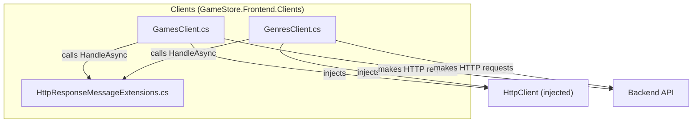

# Phase 5 Architecture — Frontend API Clients

The diagram shows two typed HTTP clients (GamesClient and GenresClient) that depend on an injected HttpClient to communicate with the backend API. Both clients use the HandleAsync extension method from HttpResponseMessageExtensions to transform HTTP responses into CommandResult objects, centralizing error handling.

---

*Generated by Codeia — re-run **Codeia: Generate Phase Diagram** to regenerate*
