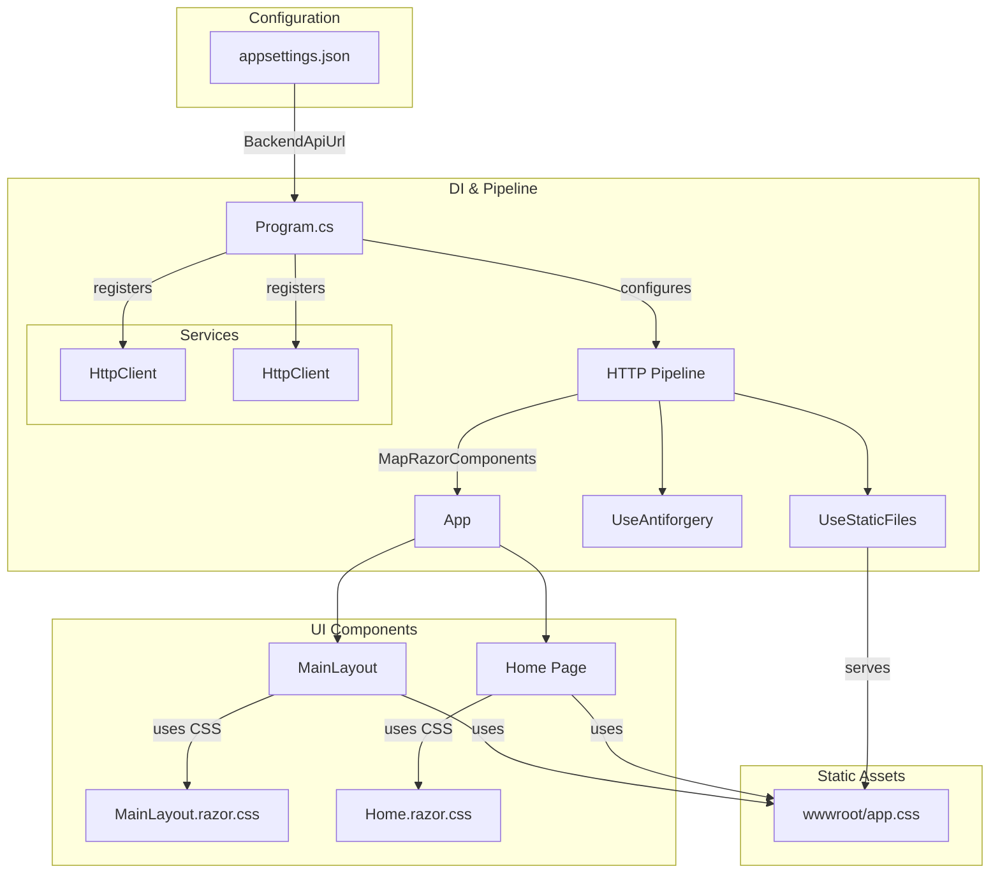

# Phase 6 Architecture — Frontend Web Application

This phase wires the Blazor UI via Program.cs, which reads BackendApiUrl from appsettings.json, registers typed HttpClient services for GamesClient and GenresClient, and builds the HTTP pipeline with static files, antiforgery, and Razor component mapping. The root App component renders MainLayout and Home pages, which pull styling from their isolated CSS files and the global app.css served from wwwroot.

---

*Generated by Codeia — re-run **Codeia: Generate Phase Diagram** to regenerate*
